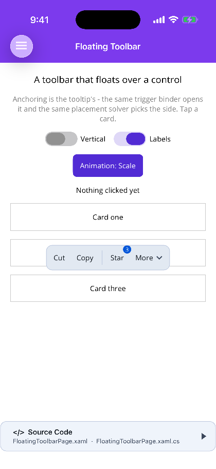
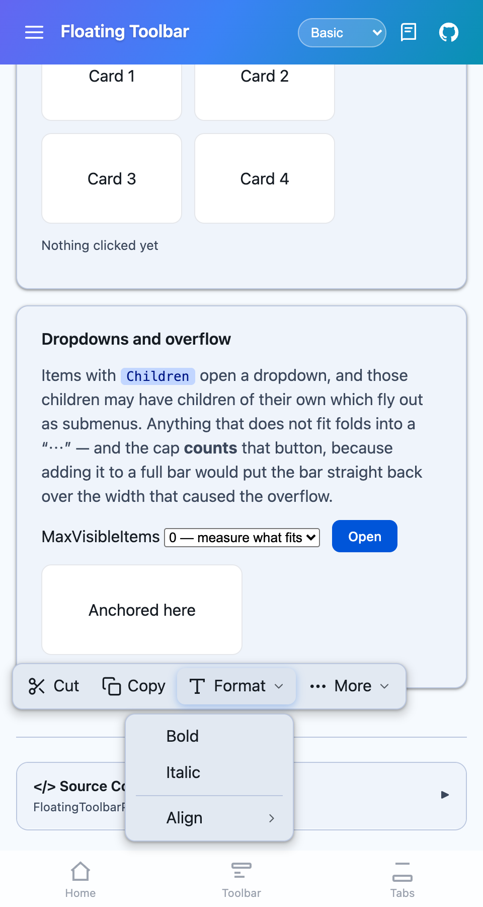

# FloatingToolbar

**MAUI + Blazor.** A toolbar that floats over a control the way a tooltip does — icons, labels, badges, dropdown menus and an overflow, laid out **across or down**, anchored to whichever control triggered it.





## What it is

Anchoring is the [tooltip](tooltip.md)'s, not a second copy of it. On MAUI the same `AnchorTriggerBinder` opens it and the same `TooltipPlacementSolver` picks the side; on Blazor `tooltip.js` supplies the placement, the top layer and the reposition-on-scroll watcher. Anchoring a bar to a control is the same problem as anchoring a bubble to one, and two implementations would only drift apart.

What is added on top is the toolbar's own half: orientation, dropdowns, overflow, and the grace period that lets the pointer reach the bar.

```xml
<shiny:FloatingToolbar Trigger="Hover" Orientation="Vertical" Target="{x:Reference card}">
    <shiny:FloatingToolbar.Items>
        <shiny:ShinyToolbarItem Text="Copy" />
        <shiny:ShinyToolbarItem Text="Delete" />
    </shiny:FloatingToolbar.Items>
</shiny:FloatingToolbar>
```

```razor
<FloatingToolbar Target=".card"
                 Trigger="TooltipTrigger.Hover"
                 Orientation="ToolbarOrientation.Vertical"
                 Items="@actions"
                 ItemClicked="OnAction" />
```

## One bar, many controls

A toolbar per row of a list means every row carries a live control that is almost never on screen. Instead one instance serves them all and re-anchors to whichever was triggered.

- **MAUI** — set the attached `FloatingToolbar.AttachTo` on each control, pointing at one instance. `CurrentTarget` and the click args say which one it is acting on, and the args carry that view's `BindingContext` — the row itself.
- **Blazor** — give `Target` a selector that matches them all (`.card`). The click args carry the index of the target that was triggered.

Triggering a *different* control while the bar is open re-anchors rather than closing: the second row's tap would otherwise read as "close", and the bar would flicker off the very row it was asked for.

## Reaching the bar

A hover toolbar that closes on pointer-exit is unusable — the pointer has to cross the gap between the target and the buttons, and the bar is gone before it gets there. `HideDelay` (250 ms by default) is what makes it work: leaving the target schedules the close, and arriving on the bar cancels it.

## Appearing and disappearing

`Animation` is the **tooltip's** `TooltipAnimation` — `None`, `Fade`, `Scale`, `Slide` — rather than a second enum meaning the same four things, and `AnimationLength` sets the duration (zero snaps). On MAUI both controls run the same `AnchoredPopoverAnimator`.

`Scale` and `Slide` are directional: they grow out of, or travel away from, the edge nearest the target. That side is the one the placer **actually** chose, not the one asked for — a bar with no room above flips below, and its entry flips with it.

On Blazor the exit is a real animation rather than a removal: the bar is put back into its start state and held there for `AnimationLength` before it leaves the DOM, because an element removed outright has nothing left to animate.

## Parameters

| Parameter | Type | Default | Notes |
|---|---|---|---|
| `Items` | item list | empty | `ShinyToolbarItem` (MAUI) / `ToolbarItem` (Blazor). Items with `Children` open a dropdown |
| `Target` | `View` (MAUI) / selector `string` (Blazor) | — | MAUI also has `TargetName`; both accept wrapping the target as content |
| `Trigger` | `TooltipTrigger` | `Tap` / `Click` | `Manual`, `Tap`/`Click`, `LongPress`, `Hover`, `Focus`; Blazor adds `HoverOrFocus` |
| `Orientation` | `ToolbarOrientation` | `Horizontal` | Also decides whether overflow is measured on width or height |
| `Placement` | `TooltipPlacement` | `Top` | `Auto` picks the side with room |
| `IsOpen` | `bool` | `false` | Two-way bindable |
| `ShowLabels` | `bool` | `false` | Draw each item's text beside its icon |
| `OverflowEnabled` | `bool` | `true` | Fold what does not fit into a `⋯` dropdown |
| `MaxVisibleItems` | `int` | `0` | Zero measures what actually fits. **The cap counts the overflow button** |
| `ShowDelay` / `HideDelay` | `int` | `0` / `250` | Milliseconds. `HideDelay` is the grace period described above |
| `LongPressDelay` | `int` | `450` | Milliseconds |
| `AutoDismissDelay` | `int` | `0` | Zero leaves the bar up |
| `DismissOnItemClick` | `bool` | `true` | |
| `DismissOnTapOutside` | `bool` (MAUI) | `true` | Blazor dismisses through the trigger instead |
| `Animation` | `TooltipAnimation` | `Scale` | `None`, `Fade`, `Scale`, `Slide` — the tooltip's enum, not a second one |
| `AnimationLength` | `int` | `140` | Milliseconds. Zero snaps |
| `Offset` / `ScreenMargin` | `double` | `8` / `12` | |
| `BarColor` / `ForegroundColor` / `CornerRadius` | | theme | |

**Events** — `ItemClicked` carries `FloatingToolbarItemEventArgs`: the item, the target it was acting on, and (MAUI) that target's `BindingContext`. `Opened` and `Closed` fire either side. MAUI adds `ItemClickedCommand` / `OpenedCommand` / `ClosedCommand`.

**Methods** — MAUI: `Show()`, `ShowFor(view)`, `Hide()`, `Toggle()`. Blazor: `ShowAsync(index)`, `HideAsync()`.

## Items

`Icon`, `Text`, `Tooltip`, `Badge`, `IconColor`, `IsEnabled`, `IsVisible`, `IsSeparator`, `Children`, `Tag` — plus `Command`/`CommandParameter` on MAUI. An item with `Children` becomes a menu button; those children may have children of their own, which fly out as submenus. A separator on the bar is a rule across it; inside a menu it is a divider.

On MAUI the type is `ShinyToolbarItem`, not `ToolbarItem`: MAUI already has a `ToolbarItem`, and a second type of that name in a namespace XAML imports wholesale resolves to whichever the compiler saw first.

## Platform notes

- The bar draws in the page's overlay layer (MAUI) or the browser's top layer (Blazor), so no `overflow: hidden` ancestor clips it and no `z-index` outranks it.
- MAUI's layer sits **below** the tooltip layer on purpose: the bar's own buttons carry tooltips, and a tip rendering under the bar it names is worse than no tip.
- `Hover` needs a pointer. On a phone it never fires; use `LongPress` or `Tap` there.

## See also

- [Tooltip](tooltip.md) — the anchoring this is built on.
- [Toolbar & TabBar](toolbar-tabbar.md) — the docked, page-level bar.
