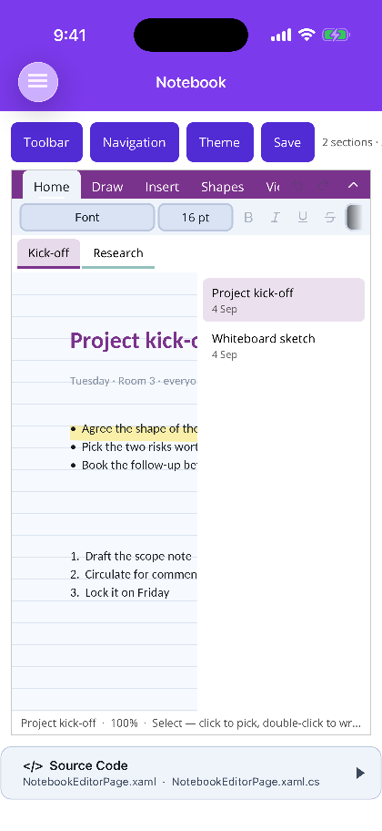
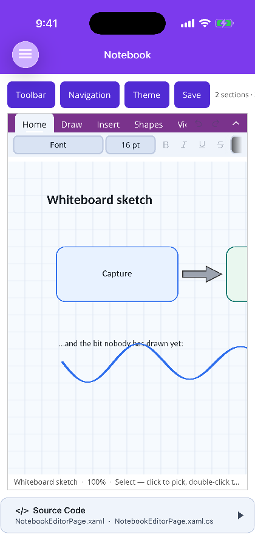
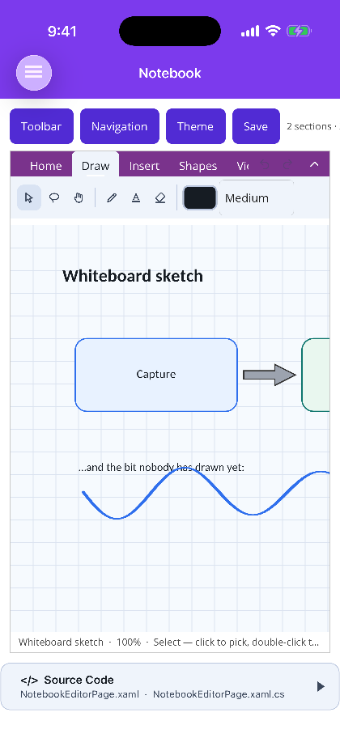

# Notebook

[← All Shiny Controls](../../README.md)

> `Shiny.Maui.Controls.Office` / `Shiny.Blazor.Controls.Office`. Two controls: `NotebookEditor` is the
> lone canvas; `NotebookEditorView` is the same thing plus the ribbon, the section tabs and the page
> list.

| Ribbon, section tabs and page list | A page of shapes and ink | The Draw tab |
|:---:|:---:|:---:|
|  |  |  |

*MAUI (iOS). The same three on Blazor are in the [Shiny docs](https://shinylib.net/controls/notebook/).*

A free-form, OneNote-style page. Write anywhere on it, draw over what you wrote, drop shapes, tables
of contents, pictures and lists wherever they belong, and keep the whole thing in a notebook of
sections and pages.

```csharp
var notebook = NotebookDocument.Create("Field notebook");
// or
using var notebook = await NotebookDocument.OpenAsync("field.shinynote");
```

```razor
<div style="height:640px">
    <NotebookEditorView Notebook="notebook" @bind-Tool="tool" NotebookChanged="OnChanged" />
</div>
```

```xml
<office:NotebookEditorView Notebook="{Binding Notebook}" />
```

## What makes it different from the slide editor

A slide is a fixed artboard and the viewer's job is to fit it to the window. A notebook page has no
edges: it **grows to hold whatever is written on it**, and the canvas scrolls and zooms instead. That
is the one structural difference — everything else (the shape geometry, the rich-text engine, the
Skia painter, the transactional undo stack) is the same machinery the `.docx` and `.pptx` editors
already run on.

`NotebookPage.Extent()` is the minimum page size unioned with every item's bounds plus `Padding`, so
there is always blank room past the furthest thing on the page to keep writing into.

## The three layers of state

| | What it is |
|---|---|
| **Tool** | What a press on the canvas *starts* — select, text, shape, pen, highlighter, eraser, lasso, pan |
| **Selection** | A **set** of item ids, because a lasso routinely catches thirty strokes and one picture, and they all move together |
| **Text editing** | A caret inside exactly one item, entered by double-clicking it, which routes typing there instead of to the canvas |

Keeping them separate is the whole design. `Escape` steps back out one layer at a time: it leaves the
text, then puts the tool down, then clears the selection.

## Gestures

| Gesture | With the Select tool |
|---|---|
| Click | Select the topmost item under the pointer |
| Double-click | Put a caret inside its text |
| Drag an item | Move it |
| Drag a handle | Resize — the whole selection scales together |
| Drag empty canvas | Marquee-select with a mouse; **pan** with a finger |
| Shift-click | Add to or remove from the selection |
| Wheel | Scroll. Ctrl/Cmd-wheel zooms about the pointer |

A finger on empty canvas pans rather than marquee-selecting, because there is no wheel to scroll
with and a marquee would leave the page unreachable — the same reasoning the spreadsheet and document
surfaces already carry on `PointerKind`.

Ink is hit-tested **against its path**, not its bounding box. A stroke's rectangle is mostly empty,
and treating it as solid makes one flourish swallow every click in that corner of the page.

## Ink

Four tools, and each is a mode the pointer stays in until another is picked — clicking the lit tool
again puts it down and returns to Select.

- **Pen** — colour and one of four nib widths. A stylus that reports real force varies the width along
  the stroke; a mouse, a finger and a pen mid-flick all report `0.5`, which draws at the nominal
  width. Switching input device does not change how thick the pen looks.
- **Highlighter** — translucent, wide, flat-capped, and painted **beneath every other item** on the
  page. Ink over text would grey the words it marks, which is exactly what a highlighter is not for.
- **Eraser** — two modes. `EraseMode.Stroke` removes a whole stroke on contact. `EraseMode.Point`
  eats only the points under the eraser and **splits** the stroke into separate items where it passes
  through, because a stroke is a single path and a hole in its point list would be drawn as a straight
  line across what was just rubbed out.
- **Lasso** — circle a region. Ink is judged on its **points** (a majority inside) rather than its box,
  so circling one word of a handwritten line does not take the whole line; everything else is judged on
  its centre.

Strokes are smoothed as a quadratic through the sample midpoints rather than drawn as a polyline. A
polyline shows every sample as a corner, which under a fast hand is a visibly faceted curve.

## Text

The same rich-text engine as the document and slide editors: fonts, sizes, bold/italic/underline/
strikethrough, colour, highlight, alignment, bulleted and numbered lists with nine outline levels.

A **text container** is OneNote's outline — it has no frame of its own unless one is asked for, and it
grows in height as you type (`AutoHeight`). Setting a specific height by dragging a top or bottom
handle turns that off, because a container told to be a specific height was told so by the user.

Typing `- ` or `1. ` at the start of a paragraph starts a list, through the same detector the Word and
PowerPoint editors use. <kbd>Backspace</kbd> at the very start of a list item **leaves the list**
rather than joining the line above — the only way out with the keyboard. <kbd>Tab</kbd> and
<kbd>Shift</kbd>+<kbd>Tab</kbd> change outline level.

Numbers are resolved from position, not stored: inserting a line in the middle of a list renumbers
everything after it, and stepping out to a shallower level and back in **restarts** the deeper run —
1, 1.1, 1.2, 2, 2.1, not 2.3. Markers run numbers, then letters, then roman, repeating past level
three.

A container the user typed nothing into is deleted when the caret leaves it. It has no outline of its
own, so an empty one would sit on the page as an invisible click-trap.

## Formatting reaches a selection, not just a caret

Unlike the slide editor, the text commands act on a **selected container** as well as on a caret
inside one. A shape with a label should go bold from one click rather than needing a double-click and
a select-all first.

## Which ink text is drawn in

Text nobody gave a colour to follows the surface it sits on, because black is where the model's
default *starts* rather than a decision anyone made — and a notebook page, unlike a document's paper,
follows the app's theme. The ground is whatever is directly behind the glyphs: a shape's own fill
where it has an opaque one, and the page otherwise. That second half matters, since a pale shape on a
dark page needs dark text and following the page alone would put pale ink on a pale fill.

A colour the author actually chose is honoured as-is, however it reads. Second-guessing one is how a
deliberately subtle caption gets repainted.

**Ink is content and is never recoloured** — a stroke laid down in black stays black when the app
flips to dark. Only the *pen* follows the theme, and only until somebody picks a colour: an unchosen
pen would otherwise draw invisible ink on a dark page, which is a defect rather than a preference.

## Pages and sections

A notebook is sections of pages: `NotebookDocument` → `NotebookSection` → `NotebookPage` → `NoteItem`.
`NotebookEditorView` shows both levels at once — sections across the top, the current section's pages
down the side — rather than as a tree. A tree makes finding a page a two-step expand-then-pick, and
the point of the section tab is that its pages are always in front of you.

There is never a section with no pages and never a notebook with no sections: deleting the last one
refills it. A section that cannot be opened is worse than an empty one.

Each page carries its own **rule** — blank, lined, grid or dots — with its own spacing and colour, and
an optional background.

| | Blazor | MAUI |
|---|---|---|
| Write, draw, erase, lasso, arrange | ✅ | ✅ |
| Typing, IME, dictation, paste | ✅ via `beforeinput` | ✅ via a hidden `Entry` |
| Pen pressure | ✅ from `PointerEventArgs.Pressure` | ✅ from `SKTouchEventArgs.Pressure` |
| Image drag-and-drop onto the page | ✅ | ✅ via `Shiny.Maui.Controls.Desktop` window file drop |
| Physical keys (arrows, shortcuts) | ✅ | ⚠️ route through `HandleKey` — MAUI has no portable key-down event |

## Undo

Everything goes through the transactional undo stack, including the commands a drag produces per
pointer sample. Those coalesce, so **a whole drag is one undo step** and **a whole typing run is one**
— and the run is broken on pointer-up, so the next drag starts a step of its own. Undoing an insert
also drops the item from the selection, so no frame is left drawn around nothing.

## The file format

`.shinynote` is a zip, and unlike the other three editors the model here **is** the truth — the file is
written from it rather than projected back into a package.

```
notebook.json          the notebook, its sections, and each page's settings
pages/{pageId}.json    that page's items, in z-order
media/{itemId}.png     one entry per embedded picture
```

Pages are separate entries because a notebook is the one Office-shaped thing here that genuinely grows
without bound; a manifest that has to be parsed in full to open the page someone clicked is the wrong
shape for that, and a per-page entry also makes a page recoverable when a neighbour is corrupt.
Pictures stay as files rather than base64 in the page — base64 costs a third again in size and defeats
the zip's own deflate on already-compressed formats.

Reads are lenient: a file from a newer writer opens rather than being refused, and a colour that will
not parse costs a highlight rather than the notebook.

```csharp
await notebook.SaveAsAsync("field.shinynote");   // atomic, through a temp file
var bytes = notebook.ToArray();
```

## Theming

The one Office surface whose **page** follows the app's theme. A document and a deck are pictures of
something printed, so tinting the paper would misrepresent what the file looks like; a notebook page
was never printed and has no canonical appearance, so a dark app with a white page reads as a control
that missed the memo. Leave `Theme` unset to follow the app, or pin it to `NotebookTheme.Light` /
`NotebookTheme.Dark`.

Existing ink is never recoloured. A stroke written in black stays black when the app flips to dark —
repainting a user's ink is not theming.

See also [Styling & theming](styling.md).
